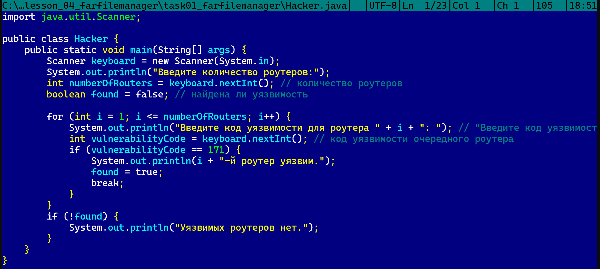
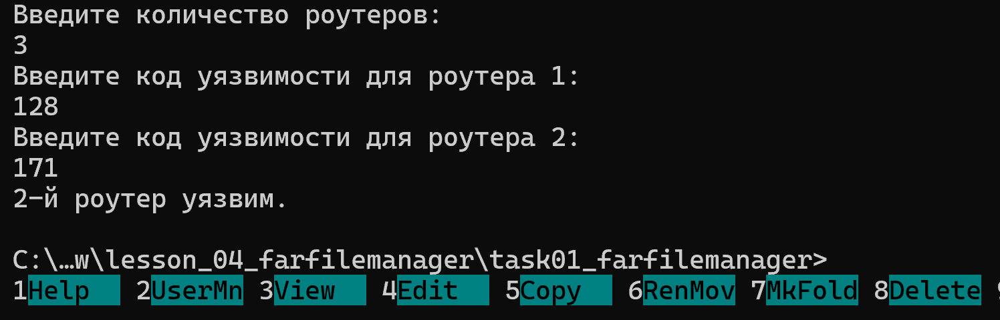
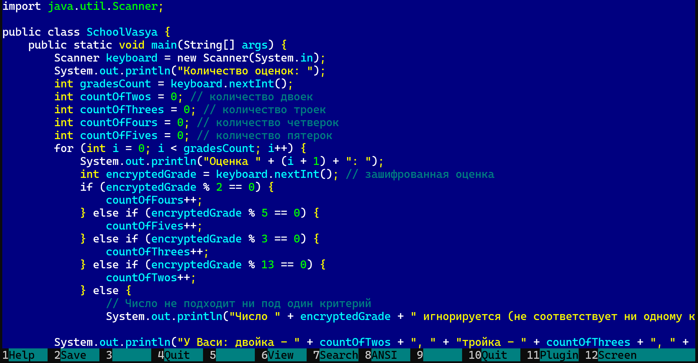
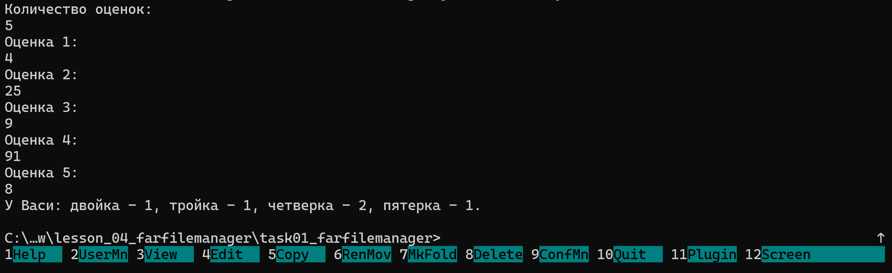
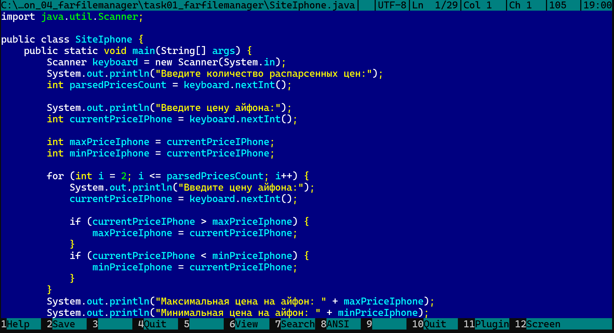
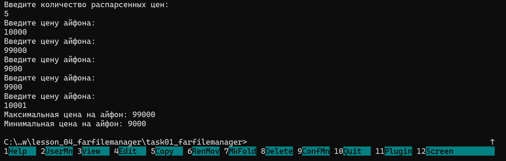

## 1. Работа с Far Manager.

**Far Manager** — это консольный файловый менеджер с двухпанельным интерфейсом и встроенным редактором с подсветкой синтаксиса.

### 1.1. Основные клавиши Far:

* **F3** — просмотр файла;
* **F4** — редактирование файла (встроенный редактор);
* **F5** — копирование;
* **F6** — перемещение;
* **F7** — создать папку;
* **F8** — удалить;

## 2. Работа с Java в Far Manager.

### 2.1. Пример 1: Hacker

**Исходный код:**

```java
import java.util.Scanner;

public class Task932Hacker {
    public static void main(String[] args) {
        Scanner keyboard = new Scanner(System.in);
        System.out.println("Введите количество роутеров:");
        int numberOfRouters = keyboard.nextInt();
        boolean found = false;

        for (int i = 1; i <= numberOfRouters; i++) {
            System.out.println("Введите код уязвимости для роутера " + i + ": ");
            int vulnerabilityCode = keyboard.nextInt();
            if (vulnerabilityCode == 171) {
                System.out.println(i + "-й роутер уязвим.");
                found = true;
                break;
            }
        }
        if (!found) {
            System.out.println("Уязвимых роутеров нет.");
        }
    }
}
```

**Код в редакторе Far Manager:**



**Результат работы:**



### 2.2. Пример 2: SchoolVasya.

**Исходный код:**

```java
import java.util.Scanner;

public class Task936SchoolVasyaEven {
    public static void main(String[] args) {
        Scanner keyboard = new Scanner(System.in);
        System.out.println("Количество оценок: ");
        int gradesCount = keyboard.nextInt();

        int countOfTwos = 0;
        int countOfThrees = 0;
        int countOfFours = 0;
        int countOfFives = 0;

        for (int i = 0; i < gradesCount; i++) {
            System.out.println("Оценка " + (i + 1) + ": ");
            int encryptedGrade = keyboard.nextInt();

            if (encryptedGrade % 2 == 0) {
                countOfFours++;
            } else if (encryptedGrade % 5 == 0) {
                countOfFives++;
            } else if (encryptedGrade % 3 == 0) {
                countOfThrees++;
            } else if (encryptedGrade % 13 == 0) {
                countOfTwos++;
            } else {
                System.out.println("Число " + encryptedGrade + " игнорируется.");
            }
        }

        System.out.println("У Васи: двойка - " + countOfTwos + ", тройка - " + countOfThrees + ", четверка - " + countOfFours + ", пятерка - " + countOfFives + ".");
    }
}
```

**Код в редакторе Far Manager:**



**Результат работы:**



### 2.3. Пример 3: SiteIphone

**Исходный код:**

```java
import java.util.Scanner;

public class Task934SiteIphone {
    public static void main(String[] args) {
        Scanner keyboard = new Scanner(System.in);
        System.out.println("Введите количество распарсенных цен:");
        int parsedPricesCount = keyboard.nextInt();

        System.out.println("Введите цену айфона:");
        int currentPriceIPhone = keyboard.nextInt();

        int maxPriceIphone = currentPriceIPhone;
        int minPriceIphone = currentPriceIPhone;

        for (int i = 2; i <= parsedPricesCount; i++) {
            System.out.println("Введите цену айфона:");
            currentPriceIPhone = keyboard.nextInt();

            if (currentPriceIPhone > maxPriceIphone) {
                maxPriceIphone = currentPriceIPhone;
            }
            if (currentPriceIPhone < minPriceIphone) {
                minPriceIphone = currentPriceIPhone;
            }
        }
        System.out.println("Максимальная цена на айфон: " + maxPriceIphone);
        System.out.println("Минимальная цена на айфон: " + minPriceIphone);
    }
}
```

**Код в редакторе Far Manager:**



**Результат работы:**

