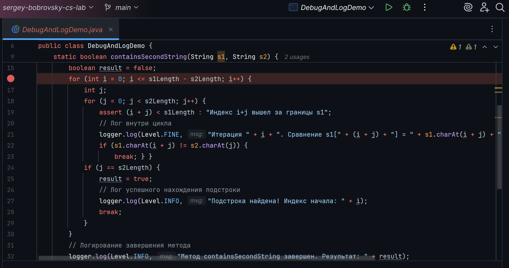
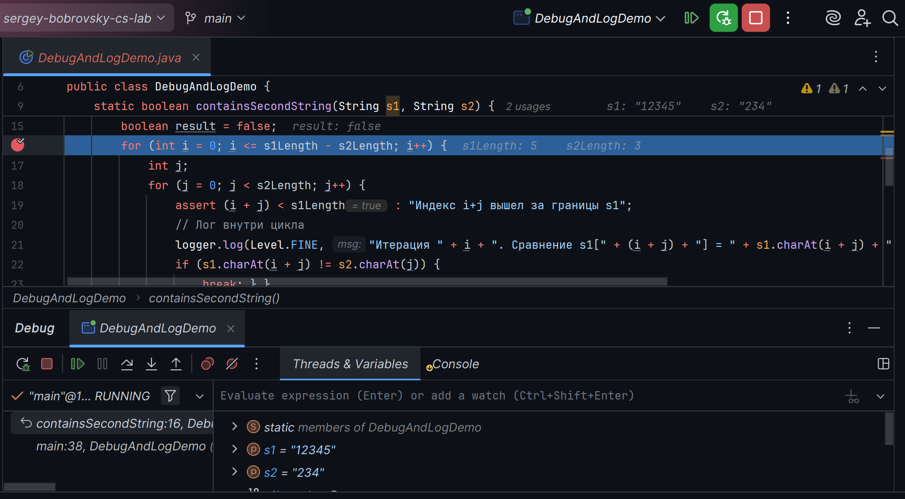
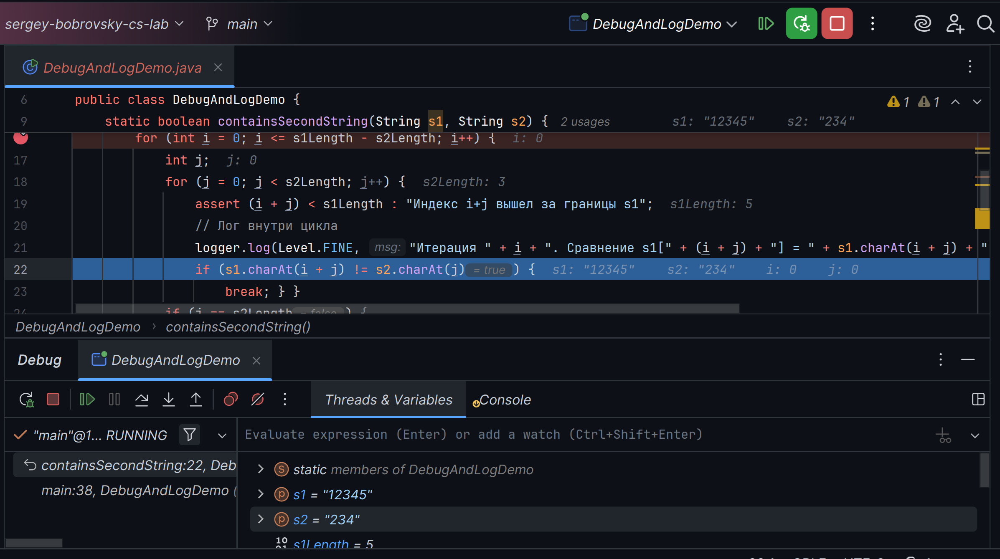
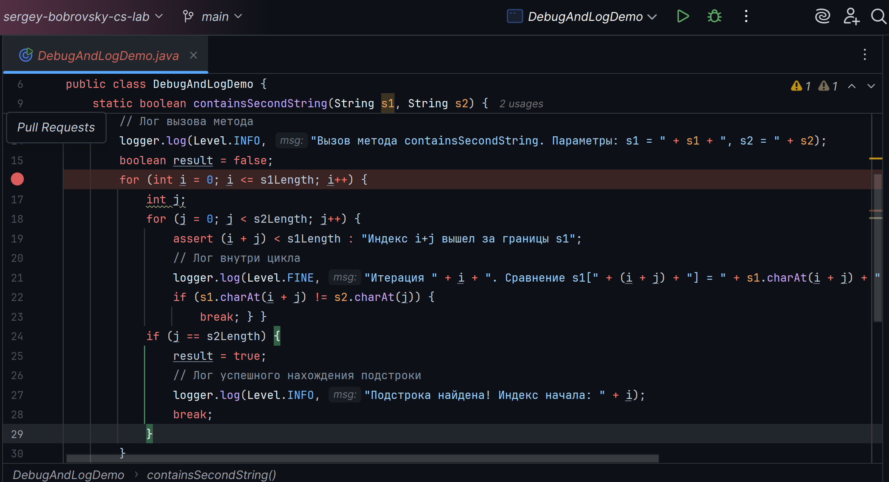
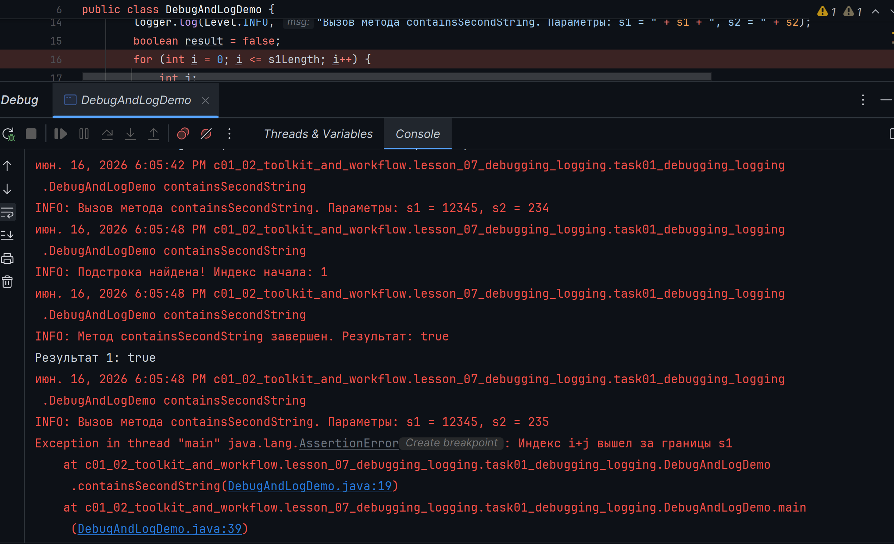

# Отладка в IntelliJ IDEA.

## 1. Установка точки прерывания.
Установил точку прерывания на строке 16(отмечена красным кружком).

## 2. Запуск в режиме отладки.
Нажал **Shift + F9** — программа остановилась на точке прерывания. Строка подсвечена синим.

## 3. Пошаговое выполнение.
Нажал несколько раз **F8** (Step Over) — курсор перешел на следующие строки.

## 4. Изменил условие цикла.
Изменил условие цикла, чтобы спровоцировать ошибку.

## 5. Assert сработал.
Assert перехватил выход за границы.

