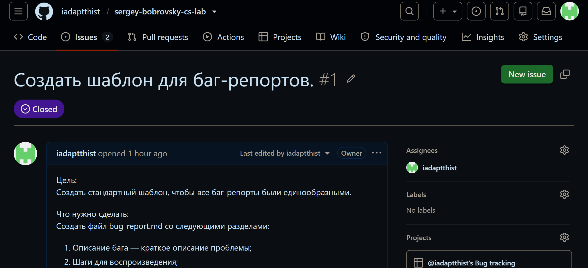
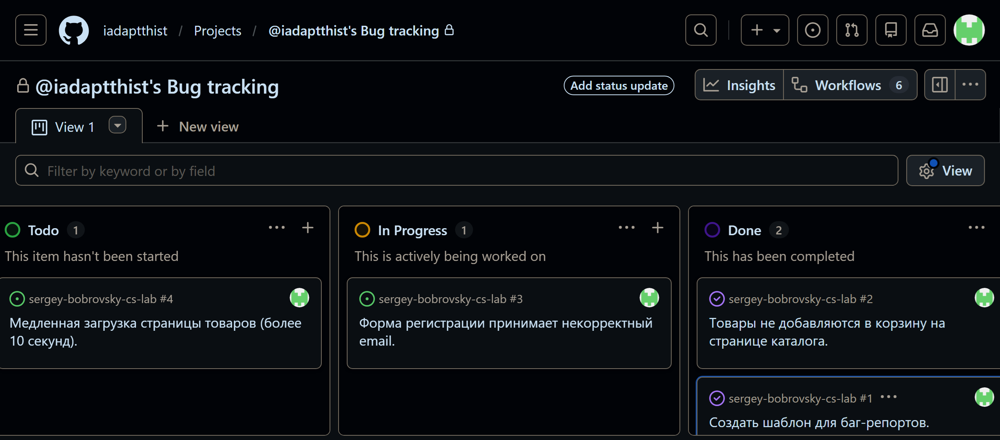
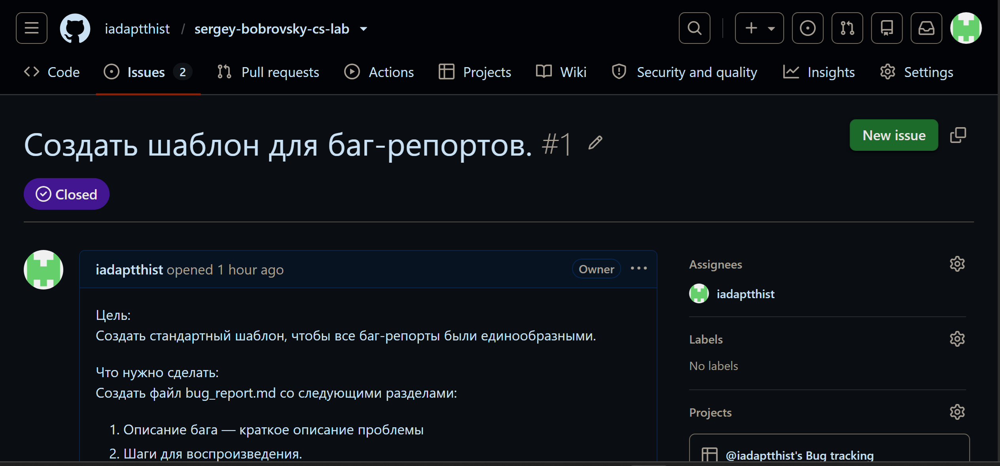

### GitHub Issues + GitHub Projects.

### Задачи.
В рамках проекта "Отслеживание багов" было создано 4 задачи:
1. Создать шаблон для баг-репортов;
2. Товары не добавляются в корзину на странице каталога;
3. Форма регистрации принимает некорректный email;
4. Медленная загрузка страницы товаров (более 10 секунд).

### Список задач.

### Доска проекта.

### Пример задачи.

